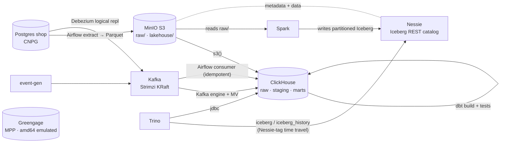

# Data Platform Lab

A laptop-scale, production-realistic miniature of a Russian DE/DWH stack on minikube —
**ClickHouse + Airflow + dbt + Kafka + MinIO + Postgres**, plus a **lakehouse** (Apache Iceberg
on Nessie, written by Spark and queried by Trino), **CDC** (Debezium), an **MPP** engine
(Greengage), and **data-quality** tests (dbt). Built for Data Engineer interview prep.



Greengage is a standalone single-host MPP demo (distribution keys + data motion), not wired
into the pipeline. See [docs/ARCHITECTURE.md](docs/ARCHITECTURE.md) for integration notes,
[docs/versions.md](docs/versions.md) for pinned versions, and
[docs/data-quality.md](docs/data-quality.md) for the DQ strategy.

## Prerequisites

- Docker Desktop with **≥ 16 GB** allocated (Settings → Resources → Memory). minikube takes 12 GB.
- `minikube`, `kubectl`, `helm` on PATH (`brew install minikube helm kubernetes-cli`).
- Apple Silicon / arm64 supported. All images are arm64-native **except Greengage**
  (amd64-only) — the `mpp` phase runs it under Docker Desktop's emulation.

> 📖 New here? [USAGE.md](USAGE.md) is the full walkthrough — launch commands, every UI, and how to
> see what each layer did.

## Quickstart (zero → batch path)

```bash
make cluster        # start minikube (4cpu / 12Gi / 40g) + metrics-server + namespace
make core           # phases 1–5: MinIO, Postgres, ClickHouse, Airflow, dbt
make sync-dags      # push dags/ + dbt/ into the Airflow PVC
make smoke          # verify every installed component
make urls           # print access table
bash scripts/port-forwards.sh   # open the consoles
```

Then trigger the batch pipeline from the Airflow UI (or `airflow dags trigger shop_batch_pipeline`).

Add the streaming path:

```bash
make streaming      # Strimzi + Kafka (KRaft) + kafka-ui + ClickHouse Kafka tables
make stream-on      # start the event generator (make stream-off to stop)
```

Optional profiles (more memory):

```bash
make query          # Trino coordinator-only: clickhouse + iceberg + tpch catalogs
make spark-demo     # run a PySpark job once (writes a partitioned Iceberg table)
```

Advanced layers (each has its own smoke test; run `make smoke` after):

```bash
make lakehouse      # phase 8:  Nessie (Iceberg REST catalog) over MinIO
                    #           then `make query` + `make spark-demo` populate/query Iceberg
make cdc            # phase 9:  Debezium (Strimzi Connect) → Kafka; then
                    #           `make airflow && make sync-dags` refresh the CDC consumer DAG
make mpp            # phase 10: single-host Greengage (Greenplum fork, amd64 emulated) + dataset
make dq             # phase 11: dbt data-quality tests (not_null / unique / relationships)
```

## Access

| Service | Local URL | Credentials |
|---|---|---|
| MinIO console | http://localhost:9001 | minioadmin / minioadmin |
| MinIO API | http://localhost:9002 (→ 9000) | minioadmin / minioadmin |
| Airflow | http://localhost:8080 | admin / admin |
| ClickHouse HTTP | http://localhost:8123 | admin / admin |
| Kafka UI | http://localhost:8081 | — |
| Trino | http://localhost:8082 | any username |
| Postgres shop | localhost:5433 (→ 5432) | shop / shop |

> ClickHouse native port 9000 collides with MinIO API 9000 on the host — do **not** port-forward
> CH native; use HTTP 8123. Lab credentials live in `infra/secrets.yaml`.

## Teardown

```bash
make down           # scale all workloads to zero, keep PVCs (data preserved)
make nuke           # DESTRUCTIVE: delete the cluster (typed confirmation required)
```

## Interview drills

A Q&A drill sheet for DE interviews — every answer backed by a command/query you can run *here* —
lives in [docs/drills/](docs/drills/README.md): batch & modeling, streaming, orchestration,
distributed & lakehouse.

## Advanced exercises (interview talking points)

- **KubernetesExecutor** instead of LocalExecutor: DAG distribution, pod templates, per-task
  resources. (This lab uses LocalExecutor for footprint.)
- **Airflow 3.x migration**: Task SDK, separate API server + dag-processor, task isolation.
  (This lab pins Airflow 2.11.1, still the production-dominant line.)
- Add **Keeper** + a 2nd ClickHouse replica. (An Iceberg/Nessie catalog for Trino is already
  wired — see `make lakehouse`.)

## Repo layout

`infra/` Helm values + manifests per component (incl. `lakehouse/` Nessie, `cdc/` Debezium,
`greengage/` MPP) · `dags/` Airflow DAGs · `dbt/shop_dwh/` dbt project · `generator/` Kafka
producer · `scripts/smoke/` per-phase smoke tests (phase0–11) · `docs/`.
Conventions for future work: [CLAUDE.md](CLAUDE.md). Pinned versions: [docs/versions.md](docs/versions.md).
