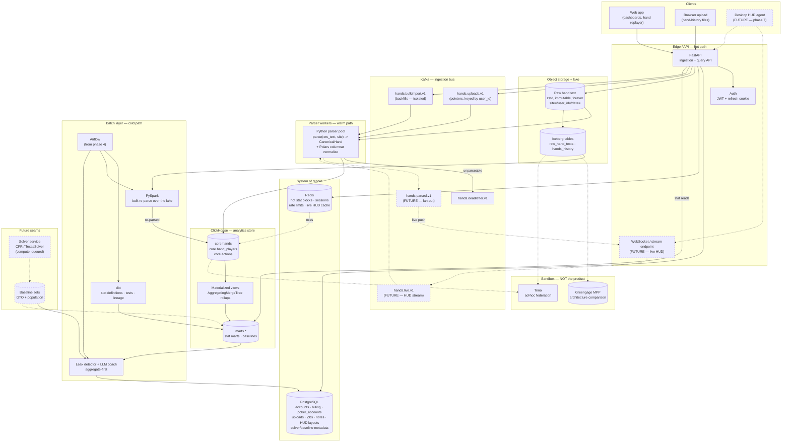
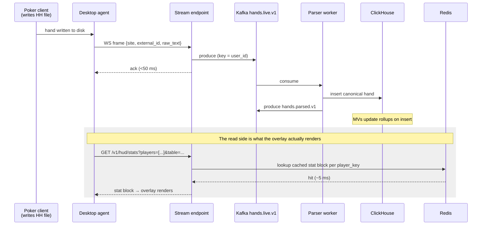
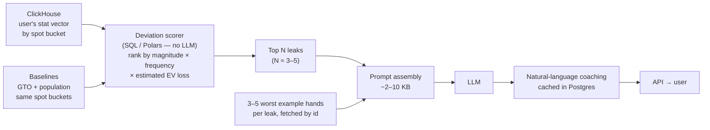

# Target architecture — poker hand-analysis platform

> Companion docs: [POKER_STATUS.md](POKER_STATUS.md) *(live progress)* · [POKER_FEATURES.md](POKER_FEATURES.md) · [POKER_GAP_ANALYSIS.md](POKER_GAP_ANALYSIS.md) · [POKER_DATA_MODEL.md](POKER_DATA_MODEL.md) · [POKER_DECISIONS.md](POKER_DECISIONS.md) · [POKER_ROADMAP.md](POKER_ROADMAP.md) · [POKER_OBSERVABILITY.md](POKER_OBSERVABILITY.md)
>
> This is the **target**, not the MVP. [POKER_ROADMAP.md](POKER_ROADMAP.md) says which parts get
> built when. Nothing here is implemented yet.

---

## The one idea that organizes everything

There are exactly **three latency classes** in this system, and almost every architectural
mistake you can make here comes from letting work drift from a slow class into a fast one.

| Class | Budget | What runs there | What must never run there |
|---|---|---|---|
| **Hot / interactive** | < 300 ms p95 | FastAPI → Redis → ClickHouse. Dashboard reads, stat lookups, HUD stat queries. | Parsing. dbt. Spark. Any LLM call. |
| **Warm / streaming** | seconds | Upload accept → object store → Kafka → parser workers → ClickHouse. ClickHouse MVs aggregating on insert. | Full-table rebuilds. Anything that scans history. |
| **Cold / batch** | minutes → hours | dbt full builds, Spark bulk re-parse, baseline refresh, ML features, LLM coaching reports. | Anything a user is waiting on. |

The **sandbox** (Greengage, Trino experiments) is a fourth thing that isn't a latency class at
all: it is off the product entirely.

If you remember one rule from this document: **ClickHouse does the interactive aggregation, and
nothing upstream of ClickHouse is allowed to be in a user's request path.**

---

## Component diagram



Dashed = future seams (HUD agent, live stream, solver/baselines). Everything else is the
platform proper.

---

## Data flow — the main path, step by step

This is the path that matters. Follow one uploaded file all the way through.

```
1. UPLOAD
   Browser POSTs a .txt/.zip to  POST /v1/uploads
   API: authenticate → check quota → compute sha256 → write to object storage
        s3://poker-raw/site=<site>/user_id=<uid>/ingested_date=<YYYY-MM-DD>/<upload_id>.txt.zst
   API: INSERT into Postgres `uploads` (status='queued')
   API: produce a POINTER message to Kafka hands.uploads.v1, key = user_id
   API: return 202 Accepted + upload_id            ← under 200 ms, no parsing happened
        ────────────────────────────────────────────────────────────────────────
        The response is fast because the API's only job is "durably accept and
        acknowledge". This is the same contract the HUD agent will use later.

2. PARSE  (parser worker pool, consuming hands.uploads.v1)
   Worker: fetch the object → split the file into individual hand texts
   Worker: for each hand → parse(raw_text, site) -> CanonicalHand
           - compute hand_uid = sha256(site + site_hand_id) or content hash
           - resolve hero seat from the user's registered poker_accounts screen names
           - derive positions from button seat + occupied seats
           - normalize currency, timestamps → UTC, chip units
   Worker: collect into Arrow/Polars batches (10k hands) → columnar normalize
   Worker: batched INSERT into ClickHouse core.hands / hand_players / actions
   Worker: unparseable hands → hands.deadletter.v1 with the error + object pointer
   Worker: UPDATE Postgres `uploads` (status, hands_found, hands_parsed, error)
   Worker: commit Kafka offsets ONLY after the ClickHouse insert succeeded
        ────────────────────────────────────────────────────────────────────────
        At-least-once delivery + ReplacingMergeTree(parsed_at) keyed by
        (user_id, hand_uid) = duplicate deliveries collapse. Exactly the pattern
        from dags/shop_cdc_consumer.py, applied to hands.

3. AGGREGATE  (ClickHouse, automatic, on insert)
   Materialized views fire on each inserted block of core.* and append
   -State partial aggregates into marts.stat_agg_* (AggregatingMergeTree).
   Cost scales with the new block, never with history.
        ────────────────────────────────────────────────────────────────────────
        This is why stats are ready seconds after upload with no orchestrator
        involved. Airflow is nowhere in this path.

4. READ
   Browser GETs /v1/stats?player=me&from=...&to=...&stakes=...
   API: check Redis for a precomputed block  → hit: return (~5 ms)
                                             → miss: query ClickHouse
                                                     -Merge() + GROUP BY over
                                                     marts.stat_agg_*, filtered by
                                                     user_id (server-side, never
                                                     from the client) → cache → return
```

**Where dbt sits:** not in that flow. dbt owns the *definitions* of the models and MVs, their
tests and their lineage, and runs full rebuilds/backfills on a schedule. See
[ADR-003](POKER_DECISIONS.md#adr-003--dbt-owns-the-stat-definitions-clickhouse-mvs-own-the-hot-path).

---

## The ingestion contract — the most important interface in the system

Everything that produces hands talks to the same contract. Browser uploads today; the desktop
HUD agent later; a bulk importer; a re-parse job. **Design it once, version it, keep it stable.**

```
POST /v1/uploads
  Auth:    Bearer <access token>
  Body:    multipart file  OR  { "site": "...", "content": "...", "client": {...} }
  Returns: 202 { upload_id, status: "queued", dedupe: "new" | "duplicate" }

GET  /v1/uploads/{upload_id}
  Returns: { status, hands_found, hands_parsed, hands_failed, error? }

POST /v1/hands:batch          ← the agent's high-frequency path
  Body:    { site, hands: [ { external_id, raw_text, observed_at } ], client: {...} }
  Returns: 202 { accepted, duplicates, rejected: [ {external_id, reason} ] }

WS   /v1/stream               ← FUTURE, live HUD (see below)
```

Three properties make this contract survive the HUD agent:

1. **Content-addressed idempotency.** Every hand carries a stable `external_id` and the server
   derives `hand_uid`; re-sending the same hand is a no-op, not a duplicate. An agent that
   crashes and re-scans a folder must be harmless.
2. **The server never trusts a client-supplied `user_id`.** Tenancy comes from the token. This
   is the single most important security property in a multi-tenant analytics system.
3. **Raw text is always carried, never just the parsed result.** Clients don't parse; the server
   does. That's what makes "fix the parser, re-parse everything" possible, and it keeps the
   agent thin.

---

## The live HUD path (future — phase 7)

You've said the HUD should **stream**, so this is designed in from the start rather than bolted
on. The agent is a thin local process that watches the poker client's hand-history folder and
pushes each hand the moment it's written — but a HUD has a requirement the batch path doesn't:
**it must answer a stat query about an opponent in under ~100 ms, while a hand is live.**



Design consequences, stated plainly:

- **Two independent paths, not one.** The write path (hand → Kafka → parser → ClickHouse) is
  eventually consistent and can take seconds. The read path (overlay asks for opponent stats) is
  served from Redis and must not wait on the write path. A HUD showing stats that are 30 seconds
  stale is completely fine; a HUD that blocks for 800 ms is unusable.
- **`hands.parsed.v1` becomes load-bearing here.** In phases 1–3 nothing needs a fan-out of
  parsed hands, so the parser writes straight to ClickHouse. The live HUD is the first consumer
  that wants a *push* — so the topic exists in the design now and gets produced to when phase 7
  arrives. This is the concrete justification for Kafka over a simple job queue
  ([ADR-004](POKER_DECISIONS.md#adr-004--kafka-in-phase-2-not-phase-1)).
- **Keying by `user_id` preserves per-user ordering** without global ordering, which is all a
  HUD needs. It also means one user's traffic never reorders another's.
- **The HUD cache is warmed, not computed on demand.** When a table is opened, the agent sends
  the seated player list; the API pre-warms Redis blocks for those `player_key`s from ClickHouse
  in one query. Per-player lazy lookups at 100 ms each would be visible.
- **Per-network gating is a product rule enforced at the agent, not the platform.** Some
  networks permit HUDs, some restrict them, some prohibit third-party tools outright. The
  platform stores stats; whether the overlay renders for a given site is a policy flag on the
  agent. Worth deciding before the agent ships, not after.
- **Anonymized sites get no HUD.** On GGPoker and similar, opponents have no persistent identity
  across hands, so there is nothing to look up. The overlay can show hero stats and table
  context only. See [POKER_DATA_MODEL.md](POKER_DATA_MODEL.md#the-ggpoker-anonymization-constraint).

---

## Multi-tenancy model

One cluster, one schema, tenant key everywhere. Not a database per user, not a schema per user
— at 100,000 users those are operational nightmares, and ClickHouse in particular is very happy
with a tenant key in the sort order.

| Layer | Mechanism |
|---|---|
| **ClickHouse** | `user_id` is the **first column of every `ORDER BY`**. This is not a convention, it's the physical layout: a query filtered by `user_id` does a binary search straight to that user's granules instead of a generic exclusion scan. Combined with `PARTITION BY toYYYYMM(played_at)`, a typical dashboard query (one user, one date range) prunes partitions *and* jumps directly within them. |
| **ClickHouse quotas** | Per-tenant `SETTINGS PROFILE` + `QUOTA`: `max_memory_usage`, `max_execution_time`, `max_rows_to_read`, queries/hour. This is what stops one heavy user's 10M-hand ad-hoc query from degrading everyone. |
| **API** | `user_id` is injected from the validated JWT into every query, server-side. **No endpoint ever accepts a tenant identifier from the client.** Query builders take the tenant as a non-optional constructor argument so it cannot be forgotten. |
| **PostgreSQL** | FK-scoped queries at MVP; Row-Level Security as a defence-in-depth layer later. |
| **Object storage** | `user_id=<uid>` prefix in every path; IAM policies scoped by prefix if you ever hand out direct access. |
| **Kafka** | `key = user_id` → per-user ordering, and a natural sharding unit. Bulk backfills go to a **separate topic** so a 10M-hand import can't starve live uploads sharing a partition. |
| **Redis** | Key namespace `stats:{user_id}:{scope-hash}`. Eviction is LRU; nothing in Redis is authoritative. |

**The skew problem, named.** Your stated distribution — most users under 500k hands, heavy users
at 5–10M — means `user_id` partitioning by hash would produce wildly uneven shards. Don't shard
by user. ClickHouse's sort key handles per-user locality; when you eventually need horizontal
scale, shard by `cityHash64(user_id)` *with* the knowledge that a handful of shards will be hot,
and consider isolating the top ~50 users onto their own shard. That's a phase-6+ problem;
recording it now so the sort key doesn't have to change later.

---

## Hot / cold storage tiering

```
        ┌─────────────────────────────────────────────────────────────┐
 HOT    │ ClickHouse, local SSD  ·  last 12–24 months of core.*       │
        │ + ALL stat rollups (marts.*) regardless of age — they're    │
        │   tiny and they're what dashboards read                     │
        ├─────────────────────────────────────────────────────────────┤
 WARM   │ ClickHouse, S3-backed disk  ·  older core.* partitions      │
        │ TTL played_at + INTERVAL 18 MONTH TO VOLUME 's3'            │
        │ Still queryable, just slower. Hand replayer for old hands.  │
        ├─────────────────────────────────────────────────────────────┤
 COLD   │ Object storage  ·  raw hand text, zstd, immutable, FOREVER  │
        │ + Iceberg tables over it for batch reprocessing             │
        │ This is the source of truth. ClickHouse is a derived cache. │
        └─────────────────────────────────────────────────────────────┘
```

The mental model that makes this simple: **ClickHouse is rebuildable and object storage is
not.** If you lost every ClickHouse table tomorrow, you could re-parse the raw text and get it
all back (slowly). If you lost the raw text, the hands are gone forever. Back up accordingly,
and let that asymmetry drive how much you're willing to spend on each tier's durability.

Compression note: hand-history text compresses roughly 8–12× with zstd, and ClickHouse's
columnar storage of the canonical model is dramatically smaller again than the text. Storage
cost is not the constraint people expect it to be.

---

## Where the AI coaching layer plugs in

**Aggregate-first, always.** The rule is that the LLM never sees raw hands in bulk — it sees a
few kilobytes of already-computed findings plus a handful of hand-picked examples.



Two things to internalize about this design:

1. **The intelligence is in the deviation scorer, not the LLM.** Ranking leaks is arithmetic
   over aggregates — comparing the user's 3-bet frequency from the button against a baseline,
   weighted by how often the spot occurs and how much EV the deviation costs. That is a SQL
   query. The LLM's job is *explaining* the ranked findings in useful English, which is what LLMs
   are actually good at.
2. **It's a batch job, not a request.** Report generation runs asynchronously (triggered by
   Airflow on a schedule or by a user action that returns a job id), the result is cached in
   Postgres, and the API serves the cached report. An LLM call has no business in a 300 ms
   budget.

---

## The solver / baselines seam

You are **not building a solver**. You are building the *hole it plugs into*, so that a solver —
open-source TexasSolver run as a compute service, or purchased solver outputs, or population
data derived from your own hands — can fill it later without disturbing anything.

```
                       ┌──────────────────────────────┐
  FUTURE               │  Solver compute service      │
  (any of these)       │  CFR / TexasSolver, queued   │──┐
                       └──────────────────────────────┘  │
                       ┌──────────────────────────────┐  │
                       │  Purchased solver outputs    │──┤
                       └──────────────────────────────┘  │   writes
                       ┌──────────────────────────────┐  │
                       │  Population baselines        │──┤
                       │  (derived from your own DB)  │  │
                       └──────────────────────────────┘  │
                                                          ▼
        ┌──────────────────────────────────────────────────────────────┐
        │  THE SEAM — baseline sets                                    │
        │  Postgres:  baseline_sets (id, source, version, created_at,  │
        │             game_type, coverage, is_active)                  │
        │  ClickHouse/lake: baseline_strategies                        │
        │             (baseline_set_id, spot_key, action, frequency,   │
        │              ev, sample_size)                                │
        │  spot_key = deterministic hash of                            │
        │    (game, stakes_bucket, positions, stack_depth_bb,          │
        │     preflop_action_sequence, street, board_texture_bucket)   │
        └──────────────────────────────────────────────────────────────┘
                                                          │  reads
                       ┌──────────────────────────────────┴───────────┐
                       ▼                                              ▼
             Deviation scorer                              Hand-level analysis
             (leak detection)                              ("here's the GTO line")
```

The whole seam is the **`spot_key`**. If the user's hands and the baselines both bucket into the
same `spot_key` space, comparison is a join. If they don't, no amount of solver quality helps.
So: define `spot_key` early, version it, and make the stat marts emit it — even in phase 1, when
there are no baselines to join against. An unjoined column costs nothing; retrofitting one costs
a full reprocess.

Note that **population baselines come free**. Once you have hands from many users, "what does
the average player at NL50 do here" is a `GROUP BY spot_key` over your own data. That is a
genuinely useful product feature that requires no solver at all, and it's how you should
validate the seam before any solver exists.

---

## Critical path vs. batch vs. sandbox — the summary table

| Component | Class | Managed or self-hosted (my call) |
|---|---|---|
| FastAPI | **Critical** | Self-hosted (it's your code) — containers on a small managed platform |
| PostgreSQL | **Critical** | **Managed.** Backups, PITR and failover are not worth your time |
| ClickHouse | **Critical** | **Managed** if budget allows (ClickHouse Cloud / Yandex Managed / Altinity). This is where self-hosting hurts most: Keeper, replication, merges, upgrades |
| Redis | **Critical** | Managed — it's cheap and it's a cache, so failure is survivable |
| Object storage | Critical (writes) | **Managed**, always. S3-compatible |
| Kafka | Warm | **Managed** (Redpanda Cloud / Confluent / MSK / Yandex). Self-hosted Kafka is a part-time job |
| Parser workers | Warm | Self-hosted (your code), horizontally scaled |
| dbt | Cold | Self-hosted, run from Airflow or CI |
| Airflow | Cold | Self-hosted at first; managed (Astronomer/MWAA/Yandex) if it grows |
| Spark | Cold | On-demand only. Nothing running when idle |
| LLM coaching | Cold | Managed API |
| **Greengage** | **Sandbox** | Local only. Never in production. See [POKER_GAP_ANALYSIS.md](POKER_GAP_ANALYSIS.md#greengage--the-mpp-sandbox) |
| **Trino** | **Sandbox** | Local only |

The one-line version for a solo maintainer: **run your own code, rent everything with a
replication protocol.**

---

## Portability — deploy anywhere, unchanged

**Hard constraint: the platform must move to any VPS or cloud without a rewrite.** The
production target is deliberately undecided, and the realistic candidates span very different
shapes — a single Hetzner box, Yandex Cloud, AWS. A design that assumes one makes the others a
migration project.

The rule that delivers it: **application code talks to protocols, never to providers.**

| Component | The portable interface | Runs unchanged on |
|---|---|---|
| Object storage | **S3 API** via `boto3` with an explicit `endpoint_url` | MinIO, AWS S3, Yandex Object Storage, Cloudflare R2, Backblaze B2, Ceph |
| Event bus | **Kafka wire protocol** via `confluent-kafka` | self-hosted Kafka, Redpanda, MSK, Confluent Cloud, Yandex Managed Kafka |
| Analytics store | ClickHouse HTTP + standard SQL | self-hosted, ClickHouse Cloud, Altinity.Cloud, Yandex Managed ClickHouse |
| System of record | PostgreSQL wire protocol via SQLAlchemy | any Postgres 16+, managed or not |
| Cache | Redis protocol | Redis, Valkey, any managed equivalent |
| Compute | OCI containers | docker-compose on one VPS, Kubernetes, ECS, Nomad |

Concretely, the rules this imposes on every file written:

1. **Config comes from environment variables only** (`api/settings.py`, `pydantic-settings`).
   No hostnames, buckets, or credentials in code. One settings object, defaults matching
   docker-compose, overridden entirely by env in any other environment.
2. **No provider SDK where a standard protocol exists.** `boto3` appears only as an S3 client
   pointed at `S3_ENDPOINT`; there is no AWS-specific call anywhere, and no cloud IAM
   assumption in application code.
3. **No serverless-only primitives** and no proprietary database extensions on the critical
   path. Everything must run as a long-lived container.
4. **`docker-compose.yml` stays able to run the entire product on one machine.** That is the
   portability test: if the whole thing can't come up on a laptop, it can't come up on a
   €40/month VPS either.
5. **Managed vs. self-hosted is a config change, not a code change.** Moving ClickHouse to a
   managed service should touch four environment variables and nothing else — which is what
   makes [ADR-013](POKER_DECISIONS.md#adr-013--rent-anything-with-a-replication-protocol) a
   deferrable decision rather than an upfront bet.

The one place this costs something: you give up provider-specific conveniences (managed
queues with per-message billing, serverless autoscale-to-zero, IAM-based auth between
services). For a solo maintainer with an undecided target, keeping the exit door open is worth
more than any of them.

## Repository layout & local development

The product lives in this repo alongside the lab, but in its own tree with its own local stack
([ADR-015](POKER_DECISIONS.md#adr-015--docker-compose-for-the-product-minikube-stays-the-learning-lab)).

```
ru_de/
├── core/                    # shared: CanonicalHand, enums, spot_key, validation
│   └── models.py            #   imported by every service — no service-specific code here
├── parser/                  # parse(raw_text, site) -> CanonicalHand + site registry
│   ├── registry.py          #   the Rust seam lives at this boundary
│   └── sites/               #   pokerstars.py, ipoker.py, ggpoker.py, …
├── ingestion/               # Kafka consumer → Polars normalize → ClickHouse batch insert
├── api/                     # FastAPI: auth, uploads, stats, filters
├── web/                     # Nuxt 4 dashboard
├── dbt/poker_dwh/           # staging → intermediate → marts (the stat layer)
├── ch/migrations/           # numbered .sql + the idempotent runner
├── infra/
│   ├── docker-compose.yml   # ClickHouse · Postgres · Kafka · Redis · MinIO
│   └── …                    # (existing minikube lab manifests stay where they are)
├── tests/
│   ├── corpus/              # real hands, the permanent regression fixture
│   └── integration/         # ingest → stats, tenant isolation
└── pyproject.toml           # uv workspace root
```

One `uv` workspace so `core` is importable everywhere without publishing, and so the Spark
re-parse job (Phase 3) imports the *same* parser the API uses rather than a second copy.

**Local stack — five services, not seventeen:**

```
make up      # docker-compose up: ClickHouse, Postgres, Kafka (KRaft, 1 broker), Redis, MinIO
             #   healthchecks + depends_on: service_healthy, so `up` means ready
make seed    # apply migrations, load the hand corpus, dbt build
make test    # ruff + mypy + pytest (unit + integration)
make down    # stop; volumes preserved
```

The minikube lab is untouched and keeps its own `make` contract. Don't run both at once without
checking headroom on a 20Gi machine — `make down` in the lab scales it to zero while keeping PVCs.

## What this means for the lab

The lab already runs the self-hosted version of nearly all of this. That's not wasted — it's the
reason you'll understand what the managed services are doing, and it's what makes the interview
answers real. But the lab is a *teaching* deployment and production is a different artifact.
Keep them separate in your head, and don't let "it works on minikube" become the production
plan. The roadmap keeps them explicitly distinct.
