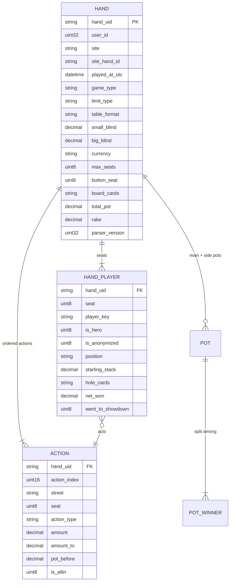

# Data model — canonical hands, storage design, and phase-1 stats

> Companion docs: [POKER_GAP_ANALYSIS.md](POKER_GAP_ANALYSIS.md) · [POKER_ARCHITECTURE.md](POKER_ARCHITECTURE.md) · [POKER_DECISIONS.md](POKER_DECISIONS.md) · [POKER_ROADMAP.md](POKER_ROADMAP.md)
>
> **Proposed, not implemented.** Every DDL block here is a design sketch to argue with, not code
> to run. Types and key choices are the parts worth scrutinizing.

---

## 1. Why a canonical model at all

Every poker network writes hand histories in its own format. PokerStars writes structured
English text. iPoker writes XML. GGPoker's PokerCraft exports approximate the PokerStars format
but anonymize opponents. 888 and partypoker each have their own text conventions, and both have
changed them across client versions. Encodings vary (UTF-8, UTF-16, cp1251), decimal separators
vary, timezones vary, and tournament chips are not money.

If any of that variation reaches your stat logic, you will write the VPIP calculation eight
times and get eight subtly different answers. So the parser's contract is absolute:

> **`parse(raw_text, site) -> CanonicalHand`. Site-specific knowledge stops at that boundary.
> Nothing downstream — not dbt, not the API, not the AI layer — ever branches on `site` for
> anything other than display and the anonymization flag.**

That interface is also the Rust seam. When one format dominates your CPU budget, you replace one
function behind this signature (PyO3/maturin) and nothing else changes. See
[ADR-001](POKER_DECISIONS.md#adr-001--python-primary-with-a-hard-parser-boundary).

---

## 2. The canonical hand model

Five entities. A hand is a small tree: one hand, N players in it, M actions across four streets,
plus a board and a settlement.



### 2.1 `hand` — one row per hand

| Field | Type | Notes |
|---|---|---|
| `hand_uid` | `String` (32 hex) | **The dedup key.** `sha256(site + ':' + site_hand_id)` truncated to 128 bits. If a site has no reliable hand id, fall back to a content hash of the normalized raw text. This is what makes re-uploading the same file free. |
| `user_id` | `UInt32` | **Tenant key.** The uploader, not the player. The same physical hand uploaded by two users is two rows — deliberately; they're separate tenants with separate data. |
| `site` | `LowCardinality(String)` | `pokerstars`, `ggpoker`, `wpn`, `ipoker`, `888`, `partypoker`, `winamax`, … |
| `site_hand_id` | `String` | As printed by the site. Not globally unique; unique per site. |
| `played_at_utc` | `DateTime64(3, 'UTC')` | Normalized. **This drives partitioning**, so it must be stable across re-parses. |
| `played_at_local` / `tz_source` | `DateTime64(3)` / `LowCardinality(String)` | Keep what the file said, so a timezone bug is diagnosable rather than silently baked in. |
| `game_type` | `LowCardinality(String)` | `holdem`, `omaha`, `omaha5`, `shortdeck`, `stud`… |
| `hole_card_count` | `UInt8` | 2 for Hold'em, 4 for PLO, 5/6 for big-O. **Make the model variant-agnostic from day one** — PLO is in MVP scope, and retrofitting a fixed two-card assumption later means touching the parser, the model, every stat, and the replayer. Store hole cards as a delimited string, not two columns. |
| `limit_type` | `LowCardinality(String)` | `nl`, `pl`, `fl` |
| `table_format` | `LowCardinality(String)` | `cash`, `mtt`, `sng`, `spin`, `rush` (fast-fold) |
| `currency` | `LowCardinality(String)` | `USD`, `EUR`, `CNY`, `chips` (tournaments) |
| `small_blind`, `big_blind`, `ante`, `straddle` | `Decimal(18,4)` | **`Decimal`, never `Float`.** Money that doesn't sum exactly is a support ticket. |
| `max_seats`, `button_seat`, `players_dealt_in` | `UInt8` | Needed to derive positions. |
| `table_name` | `String` | Meaningless for fast-fold formats; keep it anyway. |
| `board_flop_1..3`, `board_turn`, `board_river` | `LowCardinality(String)` | Five nullable card slots beats a parsed array for filtering. `Ah`, `Td`, … |
| `total_pot`, `rake`, `jackpot_drop` | `Decimal(18,4)` | Rake matters: it's the difference between "winning player" and "winning player after rake". |
| `hero_seat` | `Nullable(UInt8)` | Null if the uploader wasn't seated (observed hands). |
| `raw_object_key`, `raw_byte_offset` | `String`, `UInt64` | **Pointer back into the lake.** How the hand replayer shows original text and how re-parse finds its input. |
| `parser_version` | `UInt32` | Which parser produced this row. Load-bearing — see §6. |
| `parsed_at` | `DateTime64(3,'UTC')` | The `ReplacingMergeTree` version column. |

### 2.2 `hand_player` — one row per seat occupied

| Field | Type | Notes |
|---|---|---|
| `hand_uid`, `user_id` | | |
| `seat` | `UInt8` | Physical seat number as printed. |
| `player_key` | `Nullable(String)` | **`site + ':' + lower(screen_name)`.** Screen names are unique per site, never across sites. `NULL` when anonymized. |
| `screen_name_raw` | `String` | Preserve the original casing for display. |
| `is_hero` | `UInt8` | Resolved by matching against the user's registered `poker_accounts` screen names. |
| `is_anonymized` | `UInt8` | Set by the parser from site rules. Gates every opponent-level stat. |
| `anon_alias` | `String` | The per-hand pseudonym (`Player_3`, `Hero+2`) — useful *within* a hand, meaningless across hands. |
| `position` | `LowCardinality(String)` | **Derived, not parsed.** `BTN` `SB` `BB` `UTG` `UTG1` `MP` `MP1` `HJ` `CO`. See §2.5. |
| `position_index` | `UInt8` | 0 = first to act preflop. Makes "in position / out of position" arithmetic. |
| `starting_stack`, `starting_stack_bb` | `Decimal(18,4)`, `Decimal(8,2)` | Stack depth in big blinds is what strategy actually depends on. |
| `hole_cards` | `String` | Known for hero always, for others only at showdown. Empty string = unknown, and **that is different from "no cards"**. |
| `total_invested`, `net_won`, `net_won_bb` | `Decimal` | `net_won` is after rake, signed. `net_won_bb` is the win-rate numerator. |
| `allin_equity`, `ev_won_bb` | `Nullable(Decimal)` | Equity at the moment of the all-in and the resulting EV-adjusted result. **Computed at parse time, never at query time** ([ADR-018](POKER_DECISIONS.md#adr-018--all-in-equity-uses-a-vetted-evaluator-computed-at-parse-time)). Null when no all-in occurred. Feeds the EV-adjusted line — the chart users check first. |
| `saw_flop`, `saw_turn`, `saw_river`, `went_to_showdown`, `won_hand` | `UInt8` | Cheap derived flags that a dozen stats need. |

### 2.3 `action` — the ordered event log

This is the largest table and the one all stat logic reads. One row per decision.

| Field | Type | Notes |
|---|---|---|
| `hand_uid`, `user_id` | | |
| `action_index` | `UInt16` | **Global order within the hand**, across all streets. Not per-street — the sequence is what stats interrogate ("did anyone raise before this player acted?"). |
| `street` | `Enum8('preflop'=0,'flop'=1,'turn'=2,'river'=3,'showdown'=4)` | |
| `seat` | `UInt8` | Join key back to `hand_player`. |
| `action_type` | `Enum8` | `post_sb` `post_bb` `post_ante` `post_straddle` `post_dead` `fold` `check` `call` `bet` `raise` `allin` `show` `muck` `uncalled_return` `win` |
| `amount` | `Decimal(18,4)` | The chips this action added to the pot. |
| `amount_to` | `Decimal(18,4)` | For raises: the total the player is raising *to*. Sites print both and confusing them is the classic parser bug (`raises $1.50 to $2.00`). |
| `pot_before`, `to_call` | `Decimal(18,4)` | Derived. Bet-sizing analysis and pot-odds stats need them, and computing them once in the parser beats recomputing them in every query. |
| `is_allin` | `UInt8` | |
| `is_voluntary` | `UInt8` | **Blind posts are not voluntary.** This one flag is why VPIP is correct. |

**Design note.** Storing `pot_before`/`to_call`/`is_voluntary` in the parser is denormalization,
and it's the right call: they're deterministic functions of the action sequence, they're needed
by nearly every stat, and computing a running pot with window functions over 50 billion rows on
every query is exactly the kind of work you pay for once at write time.

### 2.4 `pot` / `pot_winner` — settlement

Side pots exist and split pots exist. A single `winner` column on the hand is wrong the first
time three players go all-in with different stacks.

```
pot(hand_uid, user_id, pot_index, pot_type ∈ {main, side}, amount, rake_share)
pot_winner(hand_uid, user_id, pot_index, seat, amount_won)
```

For phase 1 you can get away with `hand_player.net_won` alone and add these tables when the
hand replayer needs them. Model them now, build them later.

### 2.5 Position derivation — worth spelling out

Positions are **not in the file**; they're derived from the button seat and which seats are
occupied. The algorithm: order occupied seats clockwise starting from the button, then name
them from the *end* backwards, because position names are relative to the button, not to seat 1.

```
occupied seats clockwise from button:  [BTN, SB, BB, UTG, ..., HJ, CO]
6-max:  BTN SB BB UTG HJ CO
9-max:  BTN SB BB UTG UTG1 MP MP1 HJ CO
heads-up: BTN(=SB) BB          ← the special case that breaks naive code
```

Two traps: **heads-up**, where the button *is* the small blind and posts first preflop but acts
last postflop; and **short-handed tables mid-hand**, where a player sits out or a table breaks.
Derive from seats actually dealt in, never from `max_seats`.

---

## 3. The GGPoker anonymization constraint

This deserves its own section because it constrains the product, not just the schema.

**What happens.** GGPoker (and Bodog/Ignition, ACR's anonymous tables, and others) replace
opponent screen names with per-hand pseudonyms. The alias in hand #1 and the alias in hand #2
have no relationship, even if it's the same human. Hero is always identifiable — it's your own
export.

**What that costs you.** Every opponent-level stat is impossible on those sites. There is no
"this villain 3-bets 11%", no HUD, no player notes that follow someone around, no exploitative
read. This is deliberate on GG's part and no parser trick works around it.

**How the model handles it, without special-casing everything downstream:**

```
hand_player.player_key    = NULL        when anonymized
hand_player.is_anonymized = 1
hand_player.anon_alias    = 'Player_3'  (valid WITHIN this hand only)
```

Then three rules, applied once, in the intermediate dbt layer:

1. **Hero stats work everywhere.** `is_hero = 1` rows are always identified, so every stat in
   §7 computes normally for the user's own play on every site. **This is most of the product.**
2. **Opponent stats are gated on `player_key IS NOT NULL`.** One `WHERE` clause in one
   intermediate model, not a `site` check scattered through forty queries.
3. **Anonymous opponents still feed population baselines.** You can't say "this villain folds
   too much", but you *can* say "at NL50 on GG, the pool folds to a button steal 62% of the
   time." Aggregate across all anonymous opponents at a stake — the identity is unnecessary
   because the aggregate is the point. This is genuinely valuable and it's what the AI layer
   consumes anyway.

**Fast-fold formats** (GG Rush & Cash, PokerStars Zoom) have a related but distinct problem: the
table dissolves after every hand, so even on non-anonymized fast-fold, `table_name` carries no
continuity and opponents are drawn from a large rotating pool. Model it with
`table_format = 'rush'` and don't build anything that assumes table persistence.

**Product consequence, stated plainly:** if you play primarily on GG, the platform you're
building is a *hero-analysis and population-comparison* tool, not a HUD. That is a completely
viable product — arguably a better one, since it's what the AI coaching layer needs — but it
should be a conscious position, not a surprise. It's one of the open questions in
[POKER_GAP_ANALYSIS.md](POKER_GAP_ANALYSIS.md#open-questions-for-you-before-the-implementation-run).

---

## 4. ClickHouse design

### 4.1 The key choice, and why

Two rules drive every table:

- **`user_id` first in `ORDER BY`** — because that's what makes a tenant's data physically
  contiguous. A dashboard query filtering `user_id = 42` hits the binary-search path on the
  sparse primary index. Put anything else first and you get generic exclusion search across
  every tenant's granules. (Your [month-01 notes](notes/month-01-takeaways.md) §2 called this:
  *put the highest-selectivity, most-filtered column first*. In a multi-tenant system, that
  column is always the tenant.)
- **`PARTITION BY toYYYYMM(played_at_utc)`** — coarse, dozens-to-low-hundreds of partitions,
  prunable by every date-ranged dashboard query, and cheap to `DROP PARTITION` for retention.
  Critically: **a re-parsed hand lands in the same partition as the original**, because
  `played_at_utc` is a property of the hand, not of the parse. That's what makes
  `ReplacingMergeTree` dedup actually work — it only collapses rows *within* a partition, the
  trap you already documented.

### 4.2 Core tables

```sql
-- Landing/canonical layer. ReplacingMergeTree so a re-parse supersedes the old row.
CREATE TABLE core.hands
(
    user_id           UInt32,
    hand_uid          String,
    site              LowCardinality(String),
    site_hand_id      String,
    played_at_utc     DateTime64(3, 'UTC'),
    game_type         LowCardinality(String),
    limit_type        LowCardinality(String),
    table_format      LowCardinality(String),
    currency          LowCardinality(String),
    small_blind       Decimal(18, 4),
    big_blind         Decimal(18, 4),
    ante              Decimal(18, 4),
    stake_level       LowCardinality(String),      -- derived: 'NL50', 'NL100', …
    max_seats         UInt8,
    players_dealt_in  UInt8,
    button_seat       UInt8,
    table_name        String,
    board_flop_1      LowCardinality(String),
    board_flop_2      LowCardinality(String),
    board_flop_3      LowCardinality(String),
    board_turn        LowCardinality(String),
    board_river       LowCardinality(String),
    total_pot         Decimal(18, 4),
    rake              Decimal(18, 4),
    hero_seat         Nullable(UInt8),
    raw_object_key    String,
    raw_byte_offset   UInt64,
    parser_version    UInt32,
    parsed_at         DateTime64(3, 'UTC') DEFAULT now64(3)
)
ENGINE = ReplacingMergeTree(parsed_at)
PARTITION BY toYYYYMM(played_at_utc)
ORDER BY (user_id, hand_uid);

CREATE TABLE core.hand_players
(
    user_id           UInt32,
    hand_uid          String,
    played_at_utc     DateTime64(3, 'UTC'),        -- denormalized for partitioning
    seat              UInt8,
    player_key        Nullable(String),
    screen_name_raw   String,
    is_hero           UInt8,
    is_anonymized     UInt8,
    anon_alias        String,
    position          LowCardinality(String),
    position_index    UInt8,
    starting_stack    Decimal(18, 4),
    starting_stack_bb Decimal(8, 2),
    hole_cards        String,
    total_invested    Decimal(18, 4),
    net_won           Decimal(18, 4),
    net_won_bb        Decimal(12, 4),
    saw_flop          UInt8,
    saw_turn          UInt8,
    saw_river         UInt8,
    went_to_showdown  UInt8,
    won_hand          UInt8,
    parsed_at         DateTime64(3, 'UTC') DEFAULT now64(3)
)
ENGINE = ReplacingMergeTree(parsed_at)
PARTITION BY toYYYYMM(played_at_utc)
ORDER BY (user_id, hand_uid, seat);

CREATE TABLE core.actions
(
    user_id       UInt32,
    hand_uid      String,
    played_at_utc DateTime64(3, 'UTC'),
    action_index  UInt16,
    street        Enum8('preflop'=0,'flop'=1,'turn'=2,'river'=3,'showdown'=4),
    seat          UInt8,
    action_type   Enum8('post_sb'=0,'post_bb'=1,'post_ante'=2,'post_straddle'=3,
                        'post_dead'=4,'fold'=5,'check'=6,'call'=7,'bet'=8,
                        'raise'=9,'allin'=10,'show'=11,'muck'=12,
                        'uncalled_return'=13,'win'=14),
    amount        Decimal(18, 4),
    amount_to     Decimal(18, 4),
    pot_before    Decimal(18, 4),
    to_call       Decimal(18, 4),
    is_allin      UInt8,
    is_voluntary  UInt8,
    parsed_at     DateTime64(3, 'UTC') DEFAULT now64(3)
)
ENGINE = ReplacingMergeTree(parsed_at)
PARTITION BY toYYYYMM(played_at_utc)
ORDER BY (user_id, hand_uid, action_index);
```

**Why `ReplacingMergeTree` and not plain `MergeTree`:** because re-parsing is a first-class
operation. Parser v7 fixes a straddle bug; you re-run it over the lake; the new rows carry a
later `parsed_at` and supersede the old ones on the next merge. No deletes, no partition
juggling. And, exactly as in your Sprint 4 loader, **read the deduplicated truth with `FINAL`**
or by aggregating with `argMax(..., parsed_at)` — never trust the raw row count.

### 4.3 The flag table — the heart of the stat layer

This is the single most important modeling decision in the product, and it is worth
understanding before writing a line of dbt.

**Every poker stat is a ratio of an *action* to an *opportunity*.** VPIP is "times voluntarily
put money in" ÷ "hands dealt in". 3-bet% is "times 3-bet" ÷ "times facing exactly one raise
with the chance to re-raise". Fold-to-c-bet is "times folded to a flop c-bet" ÷ "times facing
one". Every single stat has this shape.

So instead of writing N different queries, you compute **one wide row per (hand, player)** with
a pair of `UInt8` counters for each stat, and then every stat — sliced by any dimension, over
any date range — is `sum(numerator) / sum(denominator)`. That's it. That's the whole design.

```sql
CREATE TABLE marts.player_hand_flags
(
    user_id            UInt32,
    hand_uid           String,
    played_at_utc      DateTime64(3, 'UTC'),
    player_key         Nullable(String),
    is_hero            UInt8,
    is_anonymized      UInt8,
    -- dimensions every stat can be sliced by
    site               LowCardinality(String),
    stake_level        LowCardinality(String),
    game_type          LowCardinality(String),
    table_format       LowCardinality(String),
    position           LowCardinality(String),
    players_dealt_in   UInt8,
    -- opportunity / action pairs
    hands_dealt        UInt8,   -- always 1; the universal denominator
    vpip_opp           UInt8,  vpip_action        UInt8,
    pfr_opp            UInt8,  pfr_action         UInt8,
    threebet_opp       UInt8,  threebet_action    UInt8,
    fold_to_3bet_opp   UInt8,  fold_to_3bet_action UInt8,
    steal_opp          UInt8,  steal_action       UInt8,
    cbet_flop_opp      UInt8,  cbet_flop_action   UInt8,
    cbet_turn_opp      UInt8,  cbet_turn_action   UInt8,
    fold_to_cbet_f_opp UInt8,  fold_to_cbet_f_action UInt8,
    saw_flop           UInt8,
    won_when_saw_flop  UInt8,
    wtsd_opp           UInt8,  wtsd_action        UInt8,
    wsd_opp            UInt8,  wsd_action         UInt8,
    aggr_bets_raises   UInt16, aggr_calls         UInt16,
    -- money
    net_won_bb         Decimal(12, 4),
    rake_paid_bb       Decimal(12, 4),
    -- the solver seam, populated from phase 1 even with no baselines to join
    preflop_spot_key   String,
    parsed_at          DateTime64(3, 'UTC')
)
ENGINE = ReplacingMergeTree(parsed_at)
PARTITION BY toYYYYMM(played_at_utc)
ORDER BY (user_id, player_key, played_at_utc, hand_uid);
```

Note the sort key differs from `core.*`: this table is read by *stat* queries, which filter by
user **and player** over a date range, so `player_key` comes second and time third.

### 4.4 Rollups — `AggregatingMergeTree` + materialized views

The flag table is one row per hand per player. For a heavy user that's 10M hands × ~6 players =
60M rows. Aggregating that live is fine in ClickHouse but wasteful for a dashboard that asks
the same question every time. So pre-aggregate on insert — which is exactly the Sprint 3
machinery.

```sql
CREATE TABLE marts.stats_daily
(
    user_id       UInt32,
    player_key    String,
    day           Date,
    site          LowCardinality(String),
    stake_level   LowCardinality(String),
    position      LowCardinality(String),
    hands              SimpleAggregateFunction(sum, UInt64),
    vpip_opp           SimpleAggregateFunction(sum, UInt64),
    vpip_action        SimpleAggregateFunction(sum, UInt64),
    pfr_opp            SimpleAggregateFunction(sum, UInt64),
    pfr_action         SimpleAggregateFunction(sum, UInt64),
    threebet_opp       SimpleAggregateFunction(sum, UInt64),
    threebet_action    SimpleAggregateFunction(sum, UInt64),
    -- … one pair per stat …
    net_won_bb         SimpleAggregateFunction(sum, Decimal(18, 4)),
    uniq_sessions      AggregateFunction(uniq, String)
)
ENGINE = AggregatingMergeTree
PARTITION BY toYYYYMM(day)
ORDER BY (user_id, player_key, day, site, stake_level, position);

CREATE MATERIALIZED VIEW marts.mv_stats_daily TO marts.stats_daily AS
SELECT
    user_id, ifNull(player_key, '') AS player_key,
    toDate(played_at_utc) AS day, site, stake_level, position,
    sum(hands_dealt)     AS hands,
    sum(vpip_opp)        AS vpip_opp,
    sum(vpip_action)     AS vpip_action,
    -- …
    sum(net_won_bb)      AS net_won_bb,
    uniqState(hand_uid)  AS uniq_sessions
FROM marts.player_hand_flags
GROUP BY user_id, player_key, day, site, stake_level, position;
```

Three things to hold onto, all of which you already learned:

- **A ClickHouse MV is an insert trigger, not a refreshed cache.** It sees only the newly
  inserted block, so its `GROUP BY` produces *partial* aggregates. That's why the target is an
  `AggregatingMergeTree` and why reads must finalize with `-Merge` / `sum()`.
- **`SimpleAggregateFunction(sum, …)` where the aggregate is additive**, `AggregateFunction` +
  `-State`/`-Merge` only where it isn't (`uniq`, quantiles). Simpler and smaller.
- **MVs are forward-only.** A new MV does not see existing rows, and `POPULATE` is unsafe on a
  live table. Backfill with the boundary-marker pattern from your Sprint 3 notes: create the MV
  with `WHERE parsed_at >= T` for a future `T`, then `INSERT … SELECT … WHERE parsed_at < T`.

Reading a stat then looks like this — and note that this is the *entire* query the API runs:

```sql
SELECT
    round(100 * sum(vpip_action)     / nullIf(sum(vpip_opp), 0),     2) AS vpip,
    round(100 * sum(pfr_action)      / nullIf(sum(pfr_opp), 0),      2) AS pfr,
    round(100 * sum(threebet_action) / nullIf(sum(threebet_opp), 0), 2) AS threebet,
    round(100 * sum(net_won_bb)      / nullIf(sum(hands), 0),        2) AS bb_per_100,
    sum(hands) AS sample
FROM marts.stats_daily
WHERE user_id = {user_id:UInt32}          -- injected server-side from the JWT
  AND player_key = {player_key:String}
  AND day BETWEEN {from:Date} AND {to:Date}
GROUP BY ();
```

`nullIf(x, 0)` is not decoration — ClickHouse returns `inf`/`nan` for division by zero without
complaint, and a new user with no 3-bet opportunities would otherwise get `nan` on their
dashboard.

### 4.5 Storage tiering

```sql
ALTER TABLE core.actions MODIFY TTL
    toDateTime(played_at_utc) + INTERVAL 18 MONTH TO VOLUME 's3';
```

`core.*` ages to S3-backed storage; `marts.*` stays hot forever because rollups are tiny and are
what dashboards read. See [POKER_ARCHITECTURE.md](POKER_ARCHITECTURE.md#hot--cold-storage-tiering).

---

## 5. PostgreSQL — the system of record

Everything mutable, transactional, and low-volume. Following your global conventions: UUID PKs,
`{table}_id` FKs, `is_`/`has_` booleans, `created_at`/`updated_at` on every table, explicit
indexes on every FK, `MetaData(naming_convention=…)` and Alembic from the first migration.

```
── identity & billing ────────────────────────────────────────────────
users(id, email, is_active, created_at, updated_at)
user_auth_identities(id, user_id, provider, provider_subject, created_at)
refresh_tokens(id, user_id, token_hash, expires_at, revoked_at)
plans(id, code, name, hand_limit, price_cents, features_json)
subscriptions(id, user_id, plan_id, status, current_period_end, ...)
invoices(id, user_id, amount_cents, currency, status, issued_at)
usage_quotas(id, user_id, period_start, hands_ingested, storage_bytes, ...)

── the poker-identity mapping (how "hero" is resolved) ───────────────
poker_accounts(id, user_id, site, screen_name, is_verified, created_at)
   └─ UNIQUE (user_id, site, screen_name)
   └─ this is what hand_player.is_hero is computed from

── ingestion job metadata ────────────────────────────────────────────
uploads(id, user_id, site, object_key, sha256, byte_size, status,
        hands_found, hands_parsed, hands_failed, error_text,
        created_at, completed_at)
   └─ UNIQUE (user_id, sha256)      ← re-uploading the same file is a no-op
parse_jobs(id, upload_id, parser_version, status, attempts,
           started_at, finished_at, error_text)
parser_versions(id, version, released_at, changelog, is_current)
reprocess_runs(id, parser_version, scope_json, status, hands_reprocessed)

── user content (mutable, low-volume → NOT ClickHouse) ───────────────
hand_notes(id, user_id, hand_uid, body, created_at, updated_at)
player_notes(id, user_id, player_key, body, color_tag, updated_at)
hand_tags(id, user_id, hand_uid, tag)
saved_filters(id, user_id, name, filter_json)
hud_layouts(id, user_id, name, layout_json, is_default)
dashboard_configs(id, user_id, config_json)

── the solver / baselines seam (metadata only; payload in CH/lake) ───
baseline_sets(id, source, solver_version, game_type, stake_bucket,
              coverage_json, is_active, created_at)
solver_runs(id, baseline_set_id, spot_key, status, requested_at, ...)

── AI coaching output (cached; regenerating is expensive) ────────────
coaching_reports(id, user_id, period_start, period_end, model,
                 findings_json, narrative_md, created_at)
```

**The dividing line, made explicit:** if a human edits it, it lives in Postgres. If it's derived
from hands, it lives in ClickHouse. `hand_notes` is a note someone typed — Postgres. `vpip` is
arithmetic over hands — ClickHouse. When you're unsure, ask "would I ever `UPDATE` a single row
of this?" ClickHouse hates that question; Postgres was built for it.

---

## 6. Data lake layout

```
s3://poker-raw/                      ← immutable, forever, the actual source of truth
  site=pokerstars/
    user_id=00042/
      ingested_date=2026-09-06/
        upload_01J8X....txt.zst      ← exactly the bytes the user uploaded

s3://poker-lake/                     ← Iceberg tables, batch-readable
  raw_hand_texts/                    ← one row per HAND (not per file)
      partition: days(ingested_at), site
      columns: hand_uid, user_id, site, site_hand_id, raw_text,
               sha256, object_key, byte_offset, ingested_at
  hands_history/                     ← canonical model, all parser versions retained
      partition: months(played_at_utc), site
      columns: <the full canonical model> + parser_version, parsed_at
```

Two layers because they answer different questions. `poker-raw` answers *"what exactly did the
user give us"* — legally and diagnostically important, never modified. `poker-lake` answers
*"give me 40 million hands as columns so Spark can re-parse or re-derive them"* — and that
needs Parquet, not text.

**Why `raw_hand_texts` is per-hand, not per-file:** because re-parsing wants hand-level
granularity ("re-parse every PokerStars hand with a straddle"), and file-level granularity makes
that a full scan of everything.

**Iceberg, not Delta** ([ADR-007](POKER_DECISIONS.md#adr-007--iceberg-over-delta-lake)). The
schema-evolution property is not academic here: the canonical model *will* gain fields — bounty
amounts, straddle details, run-it-twice boards — and Iceberg lets you add them without
rewriting history. Sprint 19 in your plan teaches exactly this, on exactly this need.

**Re-parse flow, end to end:** parser v7 ships → a Spark job reads `raw_hand_texts` filtered to
the affected scope → runs the *same* `parse()` function (packaged as a Python wheel the Spark
job imports — one implementation, never two) → writes canonical rows with
`parser_version = 7, parsed_at = now()` → inserts to `core.*` → `ReplacingMergeTree` supersedes
the old rows on merge → dbt rebuilds the affected flag/rollup partitions. Nothing is deleted and
you can always tell which parser produced a row.

---

## 7. Kafka topic design

| Topic | Key | Value | Partitions | Retention | Purpose |
|---|---|---|---|---|---|
| `hands.uploads.v1` | `user_id` | pointer: `{upload_id, user_id, site, object_key, sha256}` | 12 | 7 d | Live upload jobs. **Small messages** — the payload is in object storage. |
| `hands.bulkimport.v1` | `user_id` | same shape | 6 | 7 d | Backfills, isolated so a 10M-hand import can't starve live uploads. |
| `hands.live.v1` | `user_id` | `{site, external_id, raw_text}` | 24 | 24 h | **Future.** HUD agent stream — carries text inline because latency matters more than message size. |
| `hands.parsed.v1` | `user_id` | canonical hand (JSON → Avro) | 24 | 24 h | **Future.** Fan-out for the live HUD read side. Not produced in phases 1–3. |
| `hands.deadletter.v1` | `user_id` | `{object_key, byte_offset, site, error, parser_version}` | 3 | 30 d | Unparseable hands. **This topic is a product feature** — it's your parser bug backlog. |

Design notes: keying by `user_id` gives per-user ordering (all a HUD needs) without global
ordering. Partition counts are starting points sized for rebalance headroom, not predictions.
Schema is JSON Schema at MVP and Avro + a registry when the agent ships and you can no longer
deploy producer and consumer together.

---

## 8. dbt project layout

```
dbt/poker_dwh/
├── dbt_project.yml
├── profiles.yml                          (reuse the shop_dwh pattern + generate_schema_name)
├── models/
│   ├── staging/                          views over core.*  — rename, cast, FINAL
│   │   ├── sources.yml                   core.hands / hand_players / actions + freshness
│   │   ├── stg_hands.sql
│   │   ├── stg_hand_players.sql
│   │   ├── stg_actions.sql
│   │   └── schema.yml                    not_null / unique / relationships
│   ├── intermediate/                     ← where ALL the poker logic lives
│   │   ├── int_preflop_sequence.sql      raise counts, who was aggressor, facing-N-bets
│   │   ├── int_postflop_context.sql      c-bet opportunities per street, facing-bet flags
│   │   ├── int_showdown.sql              saw-flop / WTSD / won-at-showdown
│   │   ├── int_spot_keys.sql             the solver seam
│   │   └── int_hand_player_flags.sql     ★ assembles the wide flag row
│   └── marts/
│       ├── fct_player_hand_flags.sql     incremental → marts.player_hand_flags
│       ├── agg_stats_daily.sql           full-rebuild reconciliation of the MV output
│       ├── agg_stats_by_position.sql
│       ├── agg_stats_by_stake.sql
│       ├── mart_winrate_timeline.sql     bb/100 over time + sample size
│       ├── dim_stat_definitions.sql      stat code → human name, formula, good/bad direction
│       └── schema.yml
├── macros/
│   ├── generate_schema_name.sql          (copy from dbt/shop_dwh — it works)
│   ├── stat_ratio.sql                    stat_ratio('vpip') → sum(action)/nullIf(sum(opp),0)
│   └── position_group.sql                BTN/CO → 'late', UTG/MP → 'early'
├── snapshots/
│   └── snap_baseline_sets.sql            SCD2 over baseline versions
└── tests/
    ├── assert_vpip_gte_pfr.sql           ★ a player cannot raise more than they play
    ├── assert_flags_le_opportunities.sql ★ no action count exceeds its opportunity count
    └── assert_no_orphan_actions.sql
```

The two starred singular tests are worth more than a dozen `not_null` tests. **VPIP ≥ PFR is a
law of poker** — every raise is also a voluntary contribution — so if it's ever violated, the
flag logic is wrong. Same for `action ≤ opportunity`. These are the tests that catch the class
of bug that would otherwise silently produce plausible-looking wrong stats, which is the worst
possible failure mode for an analytics product.

**`dim_stat_definitions` is not filler either.** Storing each stat's human name, formula, and
whether higher is better means the API, the frontend and the LLM prompt all read the *same*
definition. It's how you avoid three drifting copies of "what does WWSF mean".

---

## 9. Phase-1 stats and their definitions

Every one of these is `sum(action) / sum(opportunity)` over `marts.player_hand_flags`.

**Preflop** (F-302)

| Stat | Opportunity (denominator) | Action (numerator) |
|---|---|---|
| **VPIP** — Voluntarily Put $ In Pot | every hand dealt in | called, bet or raised preflop — **excluding blind and ante posts** |
| **PFR** — Preflop Raise | every hand dealt in | raised preflop at any point |
| **3-Bet%** | faced exactly one raise, with the chance to re-raise | re-raised |
| **Fold to 3-Bet** | open-raised, then faced a 3-bet | folded |
| **4-Bet%** | faced a 3-bet after open-raising | re-raised again |
| **Fold to 4-Bet** | 3-bet, then faced a 4-bet | folded |
| **Cold Call%** | faced a raise with no prior investment | called |
| **Squeeze%** | faced a raise **and** at least one caller | re-raised |
| **Limp%** | first-in opportunity | called the big blind |

**Steal & blind defense** (F-303)

| Stat | Opportunity | Action |
|---|---|---|
| **Steal%** | first-in from CO, BTN or SB | raised |
| **Fold BB to Steal** | in BB facing a steal attempt | folded |
| **Fold SB to Steal** | in SB facing a steal attempt | folded |
| **Blind Defense%** | in a blind facing a steal | called or raised |
| **3-Bet vs Steal** | in a blind facing a steal | re-raised |

**Postflop aggression, by street** (F-304)

| Stat | Opportunity | Action |
|---|---|---|
| **C-Bet Flop** | was the preflop aggressor **and** saw the flop | bet the flop |
| **C-Bet Turn** (double barrel) | c-bet the flop, was called, saw the turn | bet the turn |
| **C-Bet River** (triple barrel) | c-bet the turn, was called, saw the river | bet the river |
| **Fold to C-Bet** (per street) | faced a c-bet on that street | folded |
| **Delayed C-Bet** | was preflop aggressor, checked the flop, saw the turn | bet the turn |

**Postflop specialty** (F-305) — the stats that separate a serious tracker from a toy

| Stat | Opportunity | Action |
|---|---|---|
| **Check-Raise** (per street) | checked, then faced a bet on that street | raised |
| **Float** | called a flop c-bet **in position**, saw the turn | bet when checked to |
| **Donk Bet** | out of position vs. the previous street's aggressor | bet before they could |
| **Probe Bet** | out of position, aggressor checked back the previous street | bet |

**Showdown & aggression** (F-306, F-307)

| Stat | Opportunity | Action |
|---|---|---|
| **WWSF** — Won When Saw Flop | saw the flop | won the pot |
| **WTSD** — Went To Showdown | saw the flop | reached showdown |
| **W$SD** — Won $ at Showdown | reached showdown | won at least one pot |
| **AF** — Aggression Factor | count of calls | bets + raises — *a ratio, not a percentage* |
| **AFq** — Aggression Frequency | bets + raises + calls + folds | bets + raises |

**Money** (F-308, F-309)

| Stat | Formula |
|---|---|
| **bb/100** | `100 × sum(net_won_bb) / sum(hands)` |
| **EV bb/100** (all-in adjusted) | `100 × sum(ev_won_bb) / sum(hands)` — the second line on the graph |
| **Rake bb/100** | `100 × sum(rake_paid_bb) / sum(hands)` |
| **Non-showdown winnings** | `sum(net_won_bb)` where `went_to_showdown = 0` |
| **Showdown winnings** | `sum(net_won_bb)` where `went_to_showdown = 1` |

Both **AF and AFq** are listed because people quote both and mean different things — storing one
and calling it "aggression" guarantees an argument with a user who expects the other.

Every one is sliceable by **position, stake level, site, table size, date range, and game type**
for free, because those are columns on the same row. That's the payoff of the flag-table design.

**Two honesty features that belong in phase 1, not later.** First, **always return the sample
size** alongside every stat. A 3-bet% computed over 40 opportunities is noise, and a product
that displays it as a number without context is actively misleading its users. Second, for
**bb/100 show a confidence interval** — win-rate variance in poker is enormous, and a player
looking at "+4 bb/100 over 8,000 hands" deserves to know that the true value could plausibly be
anywhere from -3 to +11. Getting this right early is a genuine differentiator; most trackers
present point estimates with false precision.

---

## 10. Parser throughput — the honest numbers

Since this is the one place Python is genuinely questioned, here's the arithmetic rather than a
vibe.

A typical hand is **2–4 KB of text, ~40 lines**. Realistic single-core throughput:

| Implementation style | Hands/sec/core |
|---|---|
| Naive: many regexes per line, an object per field, Pydantic validation per hand | 300 – 800 |
| Careful: line-based state machine, precompiled regexes, `__slots__`/dataclasses, batch validation | **1,500 – 5,000** |
| Rust (PyO3) for one hot format | 20,000 – 50,000 |

Now the workloads that matter:

- **A heavy user's one-time import, 10M hands.** At 2,000 h/s/core: ~83 minutes on one core,
  ~10 minutes across 8 workers. This is a background job with a progress bar. Fine.
- **Steady state at 100k users.** Assume ~1,000 hands/user/day → 100M hands/day → **~1,150
  hands/sec sustained**. At 2,000 h/s/core that's roughly **one core**, plus headroom for bursts
  and the daily peak. Fine, and not close.
- **The live HUD path.** One hand at a time, latency-bound not throughput-bound. Python's
  per-hand latency (sub-millisecond parse) is irrelevant next to network round-trips. Fine.

**Conclusion: Python is not the bottleneck, and the instinct to reach for Rust early is wrong
here.** What *will* hurt, in order: (1) per-hand Pydantic validation — validate at the API
boundary, not per hand; (2) per-hand database round-trips — batch 10k rows per insert; (3)
naive regex use — a state machine over lines beats regex-per-line by several times.

**Where Polars earns its place:** after parsing, when you have 10k hands as Python objects and
need to compute derived columns (positions, stack depths in bb, currency normalization,
`is_voluntary` flags) before insertion. Doing that as a vectorized Arrow operation instead of a
Python loop is a 10–50× win on that step, and it hands ClickHouse a columnar batch directly.
Note that Polars does *not* compute stats — stat logic lives in dbt, per the locked decision.
Polars does mechanical normalization only.

**Keep the Rust seam anyway.** Not because you'll need it soon, but because it costs nothing to
maintain a clean `parse(raw_text, site) -> CanonicalHand` boundary, and if one format ever
becomes 60% of your CPU bill you'll want the option. Design for it; don't build it.

---

## 11. The filter engine

Filtering is what turns a stats table into a tool. It's also the security-critical component of
the whole product, because it's the one place where user input becomes SQL.

### 11.1 Precomputed filter dimensions

Filters must be **columns on the flag table**, not computed at query time. A filter that requires
a subquery over `core.actions` costs seconds; a filter that's a `WHERE` on an indexed
`LowCardinality` column costs nothing.

| Filter (feature) | Column on `player_hand_flags` | Notes |
|---|---|---|
| Date, stakes, position, site, game type, table size (F-401) | already present | free |
| **Board texture** (F-402) | `flop_texture`, `turn_texture`, `river_texture` | see below |
| **Action sequence** (F-403) | `preflop_seq`, `flop_seq`, `turn_seq`, `river_seq` | compact encoded strings, e.g. `r-c-R-f` |
| **Stack depth / SPR** (F-404) | `eff_stack_bb`, `spr_flop`, `spr_turn`, `spr_river` | bucketed *and* raw |
| **Holding** (F-405) | `hole_cards`, `hole_class` | `hole_class` = `AKs`, `TT`, `A5o` — 169 values for Hold'em |
| **Players** (F-406) | `players_dealt_in`, `players_to_flop` | heads-up vs. multiway changes everything |
| Tournament stage (F-407) | `tourney_stage`, `blind_level`, `players_left` | Expansion |

### 11.2 Board texture classification

A flop is classified once, at parse time, into orthogonal facets rather than one label — because
users filter on combinations ("paired **and** monotone"), not on a taxonomy.

```
paired        ∈ {unpaired, paired, trips}
suitedness    ∈ {rainbow, two-tone, monotone}
connectedness ∈ {disconnected, gapped, connected}
high_card     ∈ {A, K, Q, J, T, low}
straight_possible, flush_possible : bool
```

Encode as a small struct of `LowCardinality` columns, and expose the combination as a single
`flop_texture` string for cheap equality filters. This also feeds `spot_key` (F-210) — which is
why it's worth doing properly in Phase 2 rather than bolting on a "wet/dry" boolean.

### 11.3 Action-sequence encoding

Store each street's action as a compact string over a fixed alphabet:

```
f fold · x check · c call · b bet · r raise · a all-in
uppercase = the hero's own action, lowercase = an opponent's
"r-c-c"     preflop: hero raised, two callers
"x-b-R-f"   flop: check, bet, hero raised, fold
```

Filtering then becomes a `LIKE` or a prefix match on an indexed string, which ClickHouse handles
well — and the same column is directly readable by the population engine (F-601), where "what does
the pool do after `x-b`" is the entire question.

### 11.4 The query compiler — the security boundary

**Never build SQL by string interpolation.** The path is:

```
JSON filter payload
  → Pydantic model (validated, typed, rejects unknown fields)
    → typed filter AST
      → parameterized ClickHouse SQL, with user_id injected from the JWT
```

Three non-negotiables:

1. **`user_id` is a constructor argument of the query builder**, not a filter field. It cannot be
   omitted, and it cannot be supplied by the client. This is the single most important line of
   defence in a multi-tenant analytics product.
2. **Every value is a bound parameter** (`{from:Date}`, `{stakes:Array(String)}`). Identifiers
   come from an allowlist derived from `dim_stat_definitions`, never from input.
3. **A CI test that tries to break isolation** — parameter tampering, injection in every string
   field, a forged `user_id` in the payload — and fails the build if any attempt succeeds.

The custom-stat builder (F-313) sits behind this same boundary: user expressions are parsed into
the same AST against an allowlisted function set, never passed through as raw SQL.
