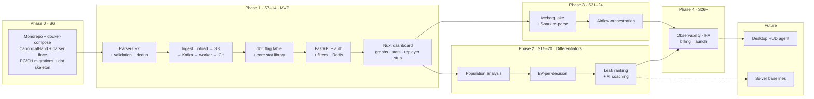

# Roadmap — phased build that doubles as the learning path

> Companion docs: [POKER_STATUS.md](POKER_STATUS.md) *(live progress)* · [POKER_FEATURES.md](POKER_FEATURES.md) · [POKER_ARCHITECTURE.md](POKER_ARCHITECTURE.md) · [POKER_DATA_MODEL.md](POKER_DATA_MODEL.md) · [POKER_DECISIONS.md](POKER_DECISIONS.md) · [POKER_GAP_ANALYSIS.md](POKER_GAP_ANALYSIS.md) · [POKER_OBSERVABILITY.md](POKER_OBSERVABILITY.md)
>
> Reconciled against [LEARNING_PLAN.md](../LEARNING_PLAN.md) (at **sprint 5**), which stays the
> source of truth for learning progress. Per your decision, **every sprint from 6 onward uses
> poker hand data** — the `shop` e-commerce dataset is retired as a teaching vehicle.

---

## The reconciliation principle

Two tracks that overlap for most of their length but optimize for different things:

- **The learning plan optimizes for interview-legible breadth.** Its terminal state is sprint 24,
  "actively apply to roles." Breadth is the point — interviewers ask about CDC and MPP whether or
  not the product needs them.
- **The product optimizes for depth on a narrow spine.** Parser → ClickHouse → stats → API → web.
  Everything else waits.

Where they align I say how; where they don't I say that instead of inventing a justification.
**Every phase ships something that runs and teaches one thing.**

---

## Recommended: resequence the learning plan

The build order and the plan order disagree in one specific, fixable way.

**The problem.** Phase 1 (MVP) needs **dbt** — that's where all stat logic lives — and does *not*
need **Airflow**, which is deferred to Phase 3 by
[ADR-005](POKER_DECISIONS.md#adr-005--airflow-deferred-to-phase-4). But the plan puts Airflow at
sprints 6–8 and dbt at 9–11. Following the plan as written means three sprints of building
orchestration the product won't use for months, while the thing it needs immediately waits.

**The fix — swap two blocks:**

| | Plan as written | Recommended |
|---|---|---|
| Sprints 6–8 | Airflow: sensors/hooks/XCom · production DAG · monitoring | **dbt: staging · intermediate→marts · incremental/SCD2** |
| Sprints 9–11 | dbt: staging · intermediate→marts · incremental/SCD2 | **Airflow: sensors/hooks/XCom · production DAG · monitoring** |

Nothing else moves. Sprint 5 (Airflow *architecture* — the mental model) finishes as planned and
is valuable either way; it's the hands-on DAG-building sprints that are better spent later, when
Phase 3 gives them real jobs to orchestrate.

**If you'd rather not reorder** (the plan warns that later topics build on earlier ones, and
that's a fair instinct): keep the order and run sprints 6–8's Airflow work **in the minikube lab**
against poker hand files landing in MinIO, while Phase 0/1 product work proceeds alongside. It
costs a few hours a week of context-switching and delays Phase 1 by roughly three weeks.

Everything below assumes the resequence. **This is a recommendation, not a change** — the plan is
yours to move.

---

## Phase overview

| Phase | Sprints | Tier | Product increment | Tool learned |
|---|---|---|---|---|
| **0 — Foundation** | 6 | MVP | Repo, local stack, canonical model, schemas | docker-compose, uv, Alembic |
| **1 — MVP thin slice** | 7–14 | MVP | **Upload → stats in a browser** | dbt (full), Kafka, FastAPI, Redis, Nuxt |
| **2 — Differentiators** | 15–20 | Differentiator | Population analysis, EV/leak detection, AI coaching | Analytical modeling, LLM integration |
| **3 — Scale & lake** | 21–24 | Expansion | Re-parse at scale, orchestration | Spark, Iceberg, Airflow |
| **S — Sandbox** | 25 | — | *(none — learning only)* | Greengage MPP comparison |
| **4 — Hardening & launch** | 26+ | — | First paying users | Prometheus/Grafana, cloud deploy |
| **5 — Future seams** | later | Future | Desktop HUD agent, solver | WebSockets, CFR integration |

---

## Phase 0 — Foundation

**Sprint 6** · Tier: MVP · Features: F-001…008, F-101, F-102, F-201, F-203, F-209, F-801, F-B01

**(a) Product increment.** Nothing user-visible — and that's correct for one week. What exists at
the end: a monorepo that builds, a local stack that comes up healthy with one command, the
canonical hand model as typed Python, the parser interface with an empty registry, Postgres and
ClickHouse schemas that migrate from empty, and a dbt project that parses.

**(b) Skill learned.** docker-compose with healthchecks and `service_healthy` dependencies; `uv`
workspaces; Alembic with a naming convention; **and why ClickHouse has no Alembic equivalent**
([ADR-017](POKER_DECISIONS.md#adr-017--clickhouse-migrations-are-versioned-sql-not-a-framework)).

**(c) Entry / exit.**
- *Entry:* sprint 5 closed; real hand-history exports available for the corpus.
- *Exit:* `make up` → all five services healthy · `make test` green · `make seed` loads the
  corpus · migrations apply cleanly from an empty volume · `dbt parse` succeeds ·
  `from core.models import CanonicalHand` works from every service.

**(d) Learning-plan mapping.** No direct counterpart — this is product scaffolding. Treat it as
the week that makes the next eight possible.

---

## Phase 1 — MVP thin slice

**Sprints 7–14** · Tier: MVP · The bulk of the parity work

**(a) Product increment.** A user registers, uploads hand histories, and sees their stats and
win-rate graph in a browser. That's the whole goal, and everything below serves it.

| Sprint | Increment | Learning-plan topic |
|---|---|---|
| **7** | PokerStars parser + regression corpus + hand validation (pot-math reconciliation) | — *(product)* |
| **8** | Second parser (iPoker XML — different *shape*, proving the interface abstracts more than regex dialect) + dedup + idempotent re-ingest | — *(product)* |
| **9** | dbt staging over `core.*`; sources + freshness | **dbt staging** *(resequenced S9→S9)* |
| **10** | dbt intermediate → **the flag table** (F-301) + first 12 stats + the two law-of-poker tests | **intermediate → marts** |
| **11** | Incremental materialization + AggregatingMergeTree rollups + MVs; SCD2 snapshot on `baseline_sets` | **incremental, SCD2** |
| **12** | Upload endpoint → MinIO → Kafka → parser worker, end-to-end. **Portfolio project #1** | **Kafka basics + portfolio #1** |
| **13** | FastAPI: auth, tenancy, filter engine + query compiler, Redis cache. All-in EV adjustment | — *(product; overlaps the big Tier-1 review)* |
| **14** | Nuxt dashboard: winnings + EV graph, stats table with filters, replayer stub. Integration test | — *(product)* |

**(b) Skill learned.** The full dbt lifecycle on data where the transformations are genuinely
non-trivial (sprint 11's SCD2 has a real home here — baseline sets are versioned reference data).
Kafka topics, partitions, consumer groups, delivery semantics. FastAPI, JWT auth, Redis. Nuxt 4 /
Vue 3 for the dashboard — recommended because your global conventions already specify it in
detail, so it's the lowest-friction choice
([ADR-016](POKER_DECISIONS.md#adr-016--nuxt-4--vue-3-for-the-dashboard)).

**(c) Entry / exit.**
- *Entry:* Phase 0 exit met.
- *Exit, all four:*
  1. A real hand-history file uploaded through the UI produces correct stats with **no manual
     steps**, in under 60 seconds.
  2. **Core stats verified by hand** against ~50 manually counted hands. Non-negotiable — every
     tracker that ever shipped had a stat-definition bug, and counting by hand is the only way to
     find them.
  3. **Tenant-isolation test in CI** that actively tries to break isolation via parameter
     tampering and fails the build if it succeeds.
  4. Killing a parser worker mid-batch and restarting produces no duplicates and no loss.

**(d) Learning-plan mapping.** Sprints 9–12 map cleanly onto their (resequenced) plan topics.
Sprints 7–8, 13–14 are product work with no plan counterpart — this is the application-layer gap
[POKER_GAP_ANALYSIS.md](POKER_GAP_ANALYSIS.md#the-application-layer--absent) identified, now
absorbed into the build rather than bolted on afterwards.

**(e) Note on scope.** This phase is eight sprints because it contains the entire application
layer *and* the entire stat library. Resist widening it. Two parsers, not seven. Twelve stats, not
forty. A stats table and two graphs, not a report builder. **The thin slice is the point** — every
feature added here delays the differentiators, which are the only reason anyone switches from PT4.

---

## Phase 2 — Differentiators

**Sprints 15–20** · Tier: Differentiator · Features: F-601…608, F-210, F-313, F-511

**(a) Product increment.** The reason to pay. Population tendencies, EV cost per leak, and
plain-language coaching.

| Sprint | Increment |
|---|---|
| **15** | `spot_key` derivation (F-210) + board-texture classification (F-402) |
| **16** | Population aggregation engine (F-601) — the ClickHouse-ideal workload a desktop tracker structurally cannot do |
| **17** | Cohort definition by stat criteria (F-602) + opponent-cohort filter (F-410) |
| **18** | EV-per-decision / action profit (F-603) — the hardest and most valuable feature in the backlog |
| **19** | Deviation scorer + leak ranking + scored recommendations (F-604/605/606). **Ship this without the LLM** |
| **20** | LLM coaching reports (F-607) + note/badge engine (F-608) |

**(b) Skill learned.** Analytical modeling at scale, and aggregate-first LLM integration — where
the hard part is *evaluation*, since "is this advice good?" has no unit test. Build a rubric and
check outputs against hands you understand.

**(c) Entry / exit.**
- *Entry:* Phase 1 exit met; ≥1M hands across ≥10 users so population baselines mean something.
- *Exit:* a coaching report identifies a leak you already knew you had — that's the validation —
  and generation costs a bounded, predictable amount per report regardless of database size.

**(d) Learning-plan mapping.** Sprints 15–16 in the plan are MPP theory + Greengage. **Those move
to sprint 25** as a sandbox week ([ADR-008](POKER_DECISIONS.md#adr-008--greengage-is-a-sandbox-not-a-product-component)) —
they deliver interview value and zero product value, so they shouldn't sit in the middle of the
differentiator run. Sprint 17–20's Spark/Iceberg topics move to Phase 3 where the product actually
needs them.

**(e) Sequencing note.** F-605 (ranked leak table) before F-607 (LLM). A ranked table saying "your
button 3-bet is 4.2% vs. a 9.1% baseline over 3,400 opportunities, costing ~1.3 bb/100" is already
a product. The LLM is the last, easiest, most replaceable step.

---

## Phase 3 — Scale & lake

**Sprints 21–24** · Tier: Expansion · Features: F-206, F-115, F-B05, F-B06

**(a) Product increment.** **A parser fix re-derives all of history.** This is what makes "keep
raw text forever" pay off, converting parser bugs from permanent corruption into a background job.
Plus scheduled, monitored batch.

| Sprint | Increment | Plan topic |
|---|---|---|
| **21** | PySpark over raw hand text; parser packaged as a wheel Spark imports — **one implementation, never two** | PySpark basics |
| **22** | Parquet lake layout + Iceberg tables; **schema evolution exercised for real** by adding straddle/bounty fields without rewriting history | MinIO+parquet · Iceberg |
| **23** | Bulk re-parse job (F-115/B06). **Portfolio project #2** | *(replaces Trino federation)* |
| **24** | Airflow orchestrates dbt builds, re-parse, baseline refresh, report generation — now that >3 interdependent jobs exist | **Airflow** *(resequenced from S6–8)* |

**(b) Entry / exit.** *Entry:* a real parser bug exists to fix (there will be one). *Exit:*
re-parse over ≥1M hands — affected stats change correctly, **unaffected stats are bit-identical**,
no duplicates, fully re-runnable. Airflow provably not in the upload→stats path.

**(c) Cut from the plan.** Sprint 20's Trino federated queries. Trino is genuinely off the product
path — ClickHouse serves interactive, Spark serves batch, and Trino has no unique job between
them. It stays installed in the lab for ad-hoc exploration.

---

## Sandbox interlude — MPP comparison

**Sprint 25** · plan sprints 15–16 compressed into one

**(a) Product increment.** *None, by design.*

**(b) Skill learned.** Distribution keys, data motion, broadcast vs. redistribute. Per your
decision to use poker data everywhere: load the same hands into Greengage, distribute `hands` and
`hand_players` by different keys, and compare the plan for a stat query against ClickHouse's. The
expected result — ClickHouse wins decisively on scan-and-aggregate, Greengage shows a Motion node
on the join — *is* the lesson, and it's the concrete evidence behind
[ADR-008](POKER_DECISIONS.md#adr-008--greengage-is-a-sandbox-not-a-product-component).

**(c) Exit.** You can explain from memory why a broadcast join hurts in MPP and why this product
uses ClickHouse. Then `kubectl -n data-platform scale statefulset/greengage --replicas=0` — it's
amd64-emulated and CPU-hungry.

---

## Phase 4 — Hardening & launch

**Sprint 26+** · beyond the current plan

Observability (Prometheus + Grafana, the six alerts from
[POKER_OBSERVABILITY.md](POKER_OBSERVABILITY.md)), HA (ClickHouse replication or managed, Postgres
PITR, Kafka RF>1), CI/CD, freemium gating (F-705), billing, the compliance position on retention
and deletion (F-707), and the first paying users. This is where
[ADR-013](POKER_DECISIONS.md#adr-013--rent-anything-with-a-replication-protocol) executes: move
the stateful components to managed services and keep minikube as the teaching artifact it is.

The learning plan's sprints 22–24 (resume, mock interviews, job search) run in parallel here —
they're job-search work, not build work, and by then you have two portfolio projects and a real
product to talk about.

---

## Phase 5 — Future seams

**Desktop HUD agent** (F-802…808). The platform work is already done if
[ADR-014](POKER_DECISIONS.md#adr-014--the-ingestion-contract-is-versioned-and-frozen-early) held:
the agent is just another client of the same contract, streaming over
[the live path](POKER_ARCHITECTURE.md#the-live-hud-path-future--phase-7). New work is the desktop
app, the overlay, the Redis pre-warm protocol, and **per-network policy gating** — GGPoker bans
HUDs outright, PokerStars restricts dynamic ones. Anonymized sites get no HUD because there's
nothing to look up.

**Solver integration** (F-904/905, F-609). TexasSolver or purchased outputs writing into the
`spot_key` baseline seam. Everything downstream already reads baselines by then, because
population baselines shipped in Phase 2 through the *same* interface — which is exactly why that
seam gets validated years before a solver exists.

---

## Sprint-by-sprint map

Assumes the resequence recommended above. **`*` = product work with no learning-plan counterpart.**

| Sprint | Learning topic | Poker increment | Phase |
|---|---|---|---|
| 5 | Airflow architecture *(current)* | — *(finish as planned)* | — |
| 6 | * | Foundation: monorepo, compose, model, schemas | 0 |
| 7 | * | PokerStars parser + validation | 1 |
| 8 | * | iPoker parser + dedup | 1 |
| 9 | dbt staging | `stg_hands` / `stg_hand_players` / `stg_actions` | 1 |
| 10 | Intermediate → marts | Flag table + 12 core stats + law-of-poker tests | 1 |
| 11 | Incremental, SCD2 | Rollups + MVs; SCD2 on baselines | 1 |
| 12 | Kafka + portfolio #1 | Upload → Kafka → worker; publish portfolio #1 | 1 |
| 13 | * *(+ big Tier-1 review)* | FastAPI, auth, filters, Redis, EV adjustment | 1 |
| 14 | * | Nuxt dashboard + integration test — **MVP ships** | 1 |
| 15 | * | `spot_key` + board texture | 2 |
| 16 | * | Population aggregation engine | 2 |
| 17 | * | Cohorts + opponent-cohort filter | 2 |
| 18 | * | EV-per-decision | 2 |
| 19 | * | Deviation scorer + leak ranking | 2 |
| 20 | * | LLM coaching + note/badge engine | 2 |
| 21 | PySpark basics | Spark over raw hand text | 3 |
| 22 | Parquet + Iceberg | Lake layout + schema evolution | 3 |
| 23 | *(was Trino)* + portfolio #2 | Bulk re-parse; publish portfolio #2 | 3 |
| 24 | Airflow *(resequenced)* | Orchestrate dbt, re-parse, reports | 3 |
| 25 | MPP + Greengage *(compressed)* | Load hands into Greengage; compare plans | S |
| 26+ | Resume · interviews · job search | Hardening, billing, launch | 4 |

**Two things that don't change.** The plan's **review blocks** and cumulative Anki decks stay
exactly where they are — switching subject matter to poker doesn't reduce the forgetting curve,
and the review at sprint 13 is the one that catches Month-1 decay. And the **golden rules** still
bind: green smoke test before commit, one commit per green phase, Anki cards each sprint, `[x]`
only after you confirm it works.

**Phase 2 is six sprints with no learning-plan topics at all.** That's the honest cost of building
the differentiators: it's product work, not curriculum. If interview readiness is the more urgent
goal at that point, Phase 2 and the plan's remaining sprints can swap order — the build doesn't
break, it just waits.
